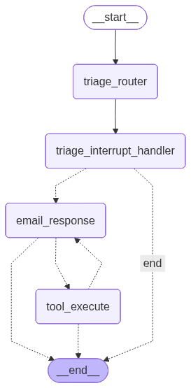

## 这个仓库是什么？
本仓库用于摸索学习Langgraph中的记忆管理，通过上下文工程增强Agent能力。

## 内容介绍
- 模拟实现了一个简单的邮件管理助手，拥有邮件分类、回复功能。
- 简单的记忆管理系统，在Memory中记录了一些个性偏好，如邮件分类偏好、邮件回复偏好。
- 简单的记忆更新功能，当用户做出与AI不同的决策时，更新偏好。

Agent流程图

## 扩展点
- 项目初衷是开发一个简单demo，所以记忆信息存放方式十分简单，可存放至SQL数据库中，实时查询更新。
- 接入向量数据库，对整个任务流程进行反思总结，转为特征向量落库，后续执行任务可从向量库中查找出相似内容，作为经验动态拼接到prompt中。

